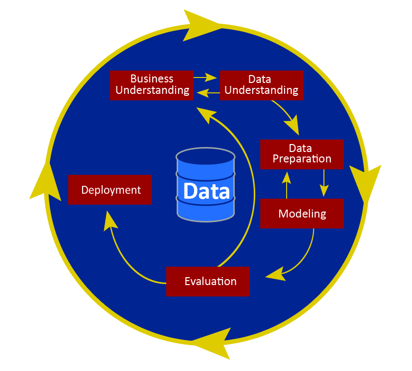

# Capstone Car Dealership Analysis

 

## Business Understanding 
__________________________________________________________________________________

Used Car Lot TM is a newly established local business in the United States. Requested some information about the top make and model of cars that sold the most in the last year nationally. From this analysis we intend on building a multiple linear regression model to predict what brand names will make the list.
The car lot intends on using this information to ensure their business objectives, marketing, and sales teams' concentrations are on point.
The information obtained will also be used to educate their staff and sales team. 

 ## Data Preparation
__________________________________________________________________________________

Exploratory Statistical analysis was used to address: 
•	Missing data 
•	Null values
•	Duplicates
•	Creation of Dummy Variables
•	Categorical Variables
•	Conversion of datatypes 
•	Complex lists and dictionaries
•	Statistical values to determine high correlation and significance
•	Multicollinearity of Independent variables
•	Reviewed for Normality of dataset
## Modelling
__________________________________________________________________________________

•	Mean Standard Error – MSE
•	Polynomial Regression using an r2 score from log transformation – (fit/overfit)
•	Cross Validation 
•	Kernel Density Estimates
•	Partition dataset to validate model using train-test splits or k-fold cross validation.

Log Transformation 
Types of Graphical representations include: 
•	scatter plots
•	histograms 
•	heat map
##2 major features that have strong relationships with the Used Cars Dataset 
1. 
2. 

##3 important statistics 
1. 
2. 
3. 

## Evaluation 
Points to review: 
•	The data reflects homoscedasticity and the residuals should follow a normal distribution
•	From this analysis we can infer that XYZ on the basis of 
•	The predictions are
•	My non-bias review is: 
•	Strong connections observed are:   
•	(Chart type) maps the validity of ZYC
•	I determine that the car sales in the USA for the following year are projected to be: 
Make: 				Model: 
## For More Information 
__________________________________________________________________________________

Please review our full analysis in the Jupyter Notebook[Jupyter Notebook] (./Capstone.ipynb) or our [Capstone](./presentation.pdf).

For more information contact **Carla Kirby, ra_carlajoy@yahoo.com**
